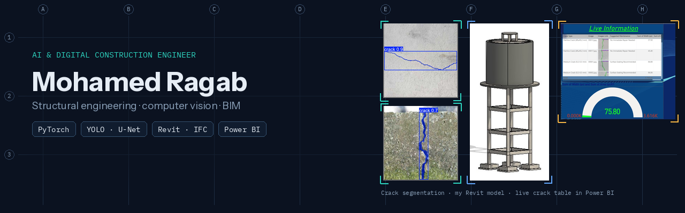

### AI & Digital Construction Engineer · structural engineering · computer vision · openBIM

I'm a structural engineer who builds software for the built environment. I train and evaluate computer-vision models on inspection photos, drawings and laser scans. I write openBIM tools that check and use IFC models, and I keep the engineering (Eurocodes, load paths, serviceability) in the loop.

My standard: **results that survive review.** That means field validation rather than benchmark-only scores, calculations reproducible by hand, tests that pin the numbers, and clear limits on what a tool may decide.

**Currently**

- Co-founder & CTO, **AECAI Ltd**: an AI-assisted structural-inspection platform (Dec 2025 onwards).
- R&D AI-Construction Specialist, **AGECS**: structural-drawing understanding and Scan-to-BIM (Apr 2026 onwards).

**Before:** 115+ structural and façade design packages as a graduate engineer at National Consulting Engineers (2023–24). MSc Digital Construction Analytics & BIM, Ulster University, **Distinction** (2025).

---

### AI for infrastructure inspection

| Project | What it shows |
|---|---|
| **[concrete-defect-detection-shm](https://github.com/mohamedragab4554/concrete-defect-detection-shm)** | YOLO-seg vs U-Net vs FPN for concrete defects, then **field validation on 44 real site images** (recall 0.933, specificity reported honestly). Tested package, model card, leakage notes. *MSc research* |
| **[water-tank-crack-digital-twin](https://github.com/mohamedragab4554/water-tank-crack-digital-twin)** | Calibrated crack width → severity class → **Revit (Dynamo), Speckle, Power BI** for a concrete water tank. *Industry project with AECOM, 80%* |

### openBIM and structural engineering tools

| Project | What it shows |
|---|---|
| **[ifc-model-auditor](https://github.com/mohamedragab4554/ifc-model-auditor)** | BIM models tested like code: ISO 19650 naming, **buildingSMART IDS**, spatial and identity checks, duplicates, quantity take-off, **schema-valid BCF 2.1**, and a GitHub Action quality gate. Found 454 duplicated MEP fittings and a mis-mapped steel export in real Revit models |
| **[ifc-load-takedown](https://github.com/mohamedragab4554/ifc-load-takedown)** | Column loads straight from IFC: Voronoi tributary areas, EN 1991-1-1 actions, **EN 1990 6.10a/b with leading and accompanying actions**, αn per category, equilibrium-checked, results written back into the IFC |
| **[ec2-crack-width](https://github.com/mohamedragab4554/ec2-crack-width)** | EN 1992-1-1 §7.3 crack widths and EN 1992-3 tightness limits, shown step by step. **Cross-checked against fib's `structuralcodes`** on 200 random cases. Compares measured crack widths with design limits |

### Construction data and forecasting

| Project | What it shows |
|---|---|
| **[uk-construction-material-price-forecasting](https://github.com/mohamedragab4554/uk-construction-material-price-forecasting)** | 7 models on ONS and DBT material price indices, **rolling-origin backtests against a no-change baseline**, and P10/P50/P90 cost escalation with a coverage test. I found that my own coursework scores were in-sample and one was fitted on 11 of 132 months. A coverage test shows the 80% bands under-cover after the 2021–23 surge. *MSc coursework, rebuilt* |

### Portfolio

| Project | What it shows |
|---|---|
| **[mohamedragab4554.github.io](https://github.com/mohamedragab4554/mohamedragab4554.github.io)** | My portfolio: Next.js + three.js with real-data 3D visuals (AI detections on structural plans, scan-to-IFC). Lighthouse 100 on desktop |

**Professional R&D (not open source):** structural-drawing understanding with an 8-class segmentation model (val mask mAP50 0.893), Scan-to-BIM from 250 M+ point laser scans to IFC, and a production inspection pipeline. These are employer and company work, shown as case studies on the **[portfolio](https://mohamedragab4554.github.io)** only.

---

### Toolbox

**AI & data:**
- PyTorch · segmentation-models-pytorch · Ultralytics YOLO · TensorFlow/Keras
- OpenCV · Open3D · NumPy · pandas · scikit-learn · statsmodels (time-series forecasting)

**openBIM:**
- IfcOpenShell · IDS / ifctester · BCF · Revit · Dynamo · Navisworks
- Speckle · Power BI · ISO 19650

**Structural:** Eurocodes (EN 1990, 1991, 1992) · AISC · ACI · ETABS · SAP2000 · SAFE · IDEA StatiCa · Tekla

**Engineering software:**
- Python · TypeScript / Next.js · pytest · GitHub Actions
- Docker · Supabase · serverless GPU inference

---

<a href="https://mohamedragab4554.github.io"><b>Portfolio</b></a> ·
<a href="https://www.linkedin.com/in/mohamed-ragab-278208199"><b>LinkedIn</b></a>

Metrics link to their source repositories. Academic work is labelled as such. Open-source tools are 2026 personal work built with AI pair-programming. Employer and client material is not published here.
